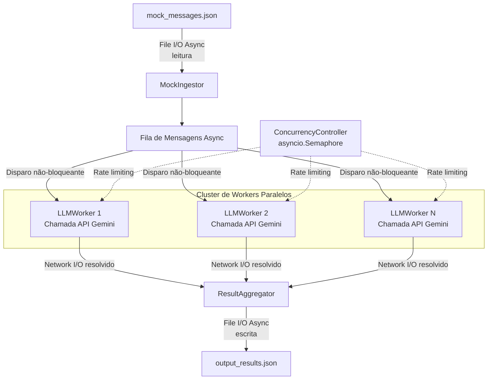
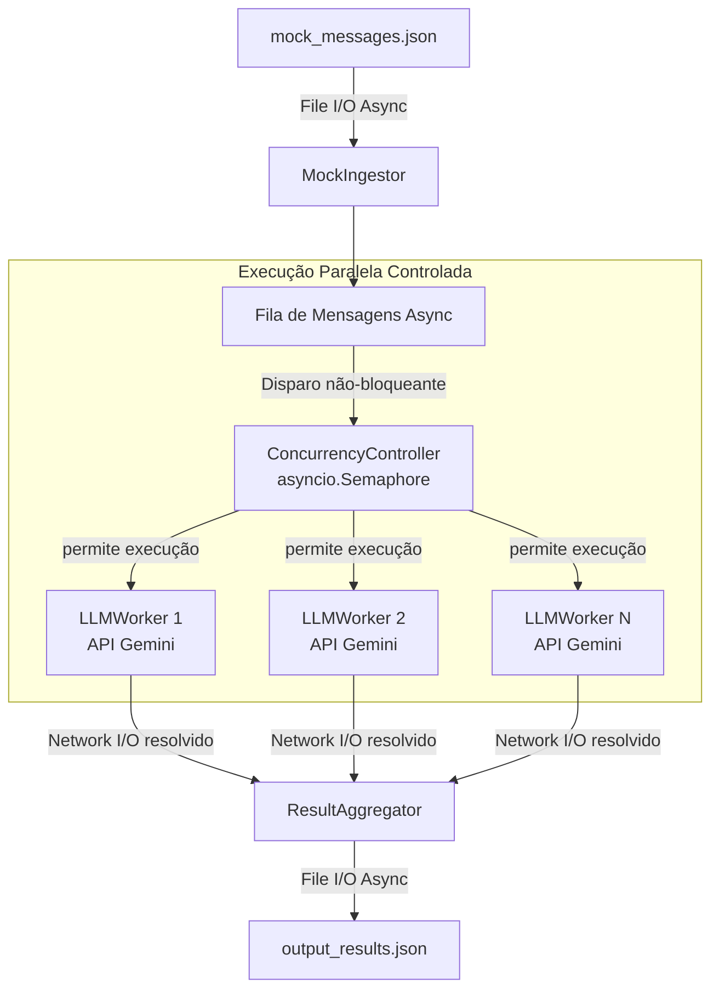

# Documentação de Arquitetura dos Agentes — Gemini API

Esta documentação descreve a topologia, a decomposição de componentes e o fluxo de execução dos agentes de IA usados para processar mensagens em alta concorrência.

A arquitetura foi desenhada para operar em modo **async/non-blocking**, com uso controlado de paralelismo, foco em I/O de rede e disco, e proteção explícita contra excesso de chamadas simultâneas à API Gemini.

---

## 1. Visão geral da arquitetura

O fluxo principal é:

```text
mock_messages.json
  -> MockIngestor
  -> Fila de Mensagens Async
  -> ConcurrencyController / asyncio.Semaphore
  -> LLMWorkers paralelos
  -> ResultAggregator
  -> output_results.json
```

A ideia central é separar três responsabilidades:

```text
1. Ingestão assíncrona de mensagens.
2. Processamento paralelo controlado por semáforo.
3. Consolidação assíncrona dos resultados.
```

O `asyncio.Semaphore` é o ponto de controle da arquitetura. Ele impede que todos os workers chamem a API ao mesmo tempo, respeitando limites de quota, evitando `HTTP 429 Too Many Requests` e mantendo o consumo de recursos previsível.

---

## 2. Diagramas da arquitetura

### 2.1. Diagrama 1 — Semaphore como controle lateral de concorrência

Este diagrama mostra o `ConcurrencyController` como uma camada lateral de controle, aplicando *rate limiting* sobre cada worker.




### 2.2. Diagrama 2 — Semaphore como guardião dos workers

Este é o diagrama recomendado para representar a implementação com mais fidelidade operacional.

Aqui, a fila dispara tarefas de forma não-bloqueante, mas cada worker só entra na chamada de API depois de passar pelo `ConcurrencyController`.




### 2.3. Diferença entre os dois diagramas

Os dois diagramas descrevem a mesma arquitetura, mas com ênfases diferentes.

| Diagrama | Melhor para | Observação |
|---|---|---|
| Diagrama 1 | Explicar conceitualmente o semáforo como controle lateral | Bom para documentação de arquitetura |
| Diagrama 2 | Explicar o fluxo real de execução | Melhor para descrever a versão implementada |

Para documentação técnica do projeto, o **Diagrama 2** deve ser tratado como a referência principal da versão com `asyncio.Semaphore`.

---

## 3. Decomposição de componentes

### 3.1. `MockIngestor`

Responsabilidade: carregar as mensagens de entrada de forma assíncrona.

Entrada típica:

```text
mock_messages.json
```

Saída típica:

```text
list[dict] ou list[IntelItem-like]
```

Mecanismo recomendado:

```python
aiofiles.open(...)
json.loads(...)
```

Vantagens:

```text
- Evita bloquear o Event Loop durante leitura de arquivo.
- Permite carregar mocks grandes sem congelar o processo principal.
- Mantém o pipeline preparado para trocar File I/O por Redis, MQ ou streaming futuramente.
```

---

### 3.2. Fila de Mensagens Async

Responsabilidade: organizar as mensagens ingeridas antes do processamento pelos workers.

Pode ser implementada de duas formas:

```text
1. Lista de coroutines disparadas por asyncio.gather.
2. asyncio.Queue para cenários com producer/consumer real.
```

Para mock simples, `asyncio.gather` é suficiente.

Para pipeline contínuo, `asyncio.Queue` tende a ser mais adequado.

---

### 3.3. `ConcurrencyController`

Responsabilidade: limitar a quantidade de chamadas simultâneas à API Gemini.

Mecanismo principal:

```python
asyncio.Semaphore(max_concurrent_requests)
```

Exemplo conceitual:

```python
semaphore = asyncio.Semaphore(2)

async with semaphore:
    response = await call_gemini(...)
```

Funções do controlador:

```text
- Evitar estouro de quota.
- Evitar HTTP 429.
- Controlar pressão sobre sockets TCP.
- Controlar consumo de memória.
- Impedir disparo explosivo de milhares de chamadas simultâneas.
```

Esse componente não transforma a mensagem; ele apenas controla quando um worker pode executar a chamada externa.

---

### 3.4. `LLMWorker`

Responsabilidade: processar uma mensagem individual e encapsular a chamada à API Gemini.

Fluxo básico:

```text
1. Recebe uma mensagem.
2. Aguarda liberação do semáforo.
3. Chama a API Gemini.
4. Normaliza o resultado.
5. Retorna payload estruturado para o agregador.
```

Se a biblioteca usada para chamar a API for bloqueante, o worker pode usar:

```python
await asyncio.to_thread(sync_gemini_call, payload)
```

Vantagem:

```text
- O Event Loop continua livre.
- A espera de rede fica isolada em thread secundária.
- O pipeline continua orquestrando outros workers enquanto uma chamada aguarda resposta.
```

---

### 3.5. `ResultAggregator`

Responsabilidade: consolidar os resultados retornados pelos workers.

Funções:

```text
- Reunir respostas.
- Preservar ordem ou mapear por ID.
- Separar sucessos e erros.
- Gerar arquivo final de saída.
```

Saída típica:

```text
output_results.json
```

Mecanismo recomendado:

```python
results = await asyncio.gather(*tasks, return_exceptions=True)
```

Para escrita em disco:

```python
aiofiles.open(...)
json.dumps(...)
```

---

## 4. Ciclo de vida da execução

### 4.1. Inicialização

O Event Loop é iniciado e o limite máximo de concorrência é configurado:

```python
max_concurrent_requests = 2
semaphore = asyncio.Semaphore(max_concurrent_requests)
```

Esse valor pode variar por ambiente:

```text
DEV: baixo, para debug.
HML: intermediário, para teste de carga.
PROD: definido conforme quota real da API.
```

---

### 4.2. Ingestão

O `MockIngestor` lê o arquivo de entrada:

```text
mock_messages.json
```

e transforma o conteúdo em uma estrutura processável.

---

### 4.3. Mapeamento de tarefas

Cada mensagem vira uma coroutine de processamento:

```python
tasks = [
    process_message(message, semaphore)
    for message in messages
]
```

---

### 4.4. Disparo concorrente controlado

Todas as tarefas podem ser criadas rapidamente, mas a execução efetiva da chamada externa é limitada pelo semáforo.

Exemplo:

```python
async def process_message(message, semaphore):
    async with semaphore:
        return await call_gemini(message)
```

Na prática:

```text
- 100 mensagens podem estar agendadas.
- Apenas N entram ao mesmo tempo na chamada Gemini.
- Quando uma termina, outra ganha permissão.
```

---

### 4.5. Drenagem de rede

À medida que workers terminam a chamada à API:

```text
- o semáforo é liberado;
- o próximo worker entra;
- o resultado volta para o agregador.
```

Esse comportamento cria uma drenagem constante e controlada.

---

### 4.6. Consolidação final

Quando todas as tarefas terminam, o `ResultAggregator` consolida o resultado:

```text
output_results.json
```

A escrita final é feita de forma assíncrona para evitar bloqueio do Event Loop.

---

## 5. Pseudocódigo de referência

```python
import asyncio
import json
import aiofiles

async def load_messages(path: str) -> list[dict]:
    async with aiofiles.open(path, "r", encoding="utf-8") as f:
        content = await f.read()
    return json.loads(content)

async def call_gemini(message: dict) -> dict:
    # Se a lib for async nativa, chame diretamente aqui.
    # Se for bloqueante, use asyncio.to_thread.
    return await asyncio.to_thread(sync_gemini_call, message)

async def process_message(message: dict, semaphore: asyncio.Semaphore) -> dict:
    async with semaphore:
        return await call_gemini(message)

async def save_results(path: str, results: list[dict]) -> None:
    async with aiofiles.open(path, "w", encoding="utf-8") as f:
        await f.write(json.dumps(results, ensure_ascii=False, indent=2))

async def main():
    messages = await load_messages("mock_messages.json")

    semaphore = asyncio.Semaphore(2)

    tasks = [
        process_message(message, semaphore)
        for message in messages
    ]

    results = await asyncio.gather(*tasks, return_exceptions=True)

    normalized_results = [
        result if not isinstance(result, Exception)
        else {"error": str(result)}
        for result in results
    ]

    await save_results("output_results.json", normalized_results)

if __name__ == "__main__":
    asyncio.run(main())
```

---

## 6. Observações de performance

### 6.1. O gargalo principal é Network I/O

A chamada Gemini tende a ser limitada por:

```text
- latência de rede;
- tempo de resposta da API;
- quota da chave;
- limite de requisições por minuto;
- limite de tokens por minuto.
```

Por isso, aumentar workers sem controle pode piorar o sistema em vez de melhorar.

---

### 6.2. O semáforo não acelera a API

O `asyncio.Semaphore` não deixa uma chamada individual mais rápida.

Ele melhora o sistema porque controla o paralelismo:

```text
Sem semaphore:
  muitas chamadas simultâneas
  maior risco de 429
  maior consumo de memória
  menor previsibilidade

Com semaphore:
  concorrência limitada
  vazão estável
  menos erros por quota
  melhor controle operacional
```

---

### 6.3. `asyncio.to_thread` só deve ser usado quando necessário

Use `asyncio.to_thread` se a chamada Gemini for bloqueante.

Se o client já for async nativo, prefira:

```python
await async_gemini_client.generate_content(...)
```

em vez de:

```python
await asyncio.to_thread(...)
```

---

## 7. Configuração recomendada

Exemplo de parâmetros por ambiente:

```json
{
  "gemini_model": "gemini-1.5-flash",
  "max_concurrent_requests": 2,
  "input_file": "mock_messages.json",
  "output_file": "output_results.json",
  "timeout_seconds": 60,
  "retries": 3
}
```

Sugestão:

```text
DEV:
  max_concurrent_requests = 1 ou 2

HML:
  max_concurrent_requests = 2 a 5

PROD:
  definido por quota real, limite de tokens e telemetria
```

---

## 8. Regras operacionais

1. Nunca chamar a API Gemini sem passar pelo `ConcurrencyController`.
2. Nunca escrever o arquivo de saída a cada worker, salvo em modo checkpoint explícito.
3. Preferir `ResultAggregator` para escrita consolidada.
4. Usar `return_exceptions=True` em `asyncio.gather` quando o objetivo for completar o lote mesmo com falhas parciais.
5. Registrar erro por mensagem, sem derrubar o lote inteiro.
6. Usar timeout e retry com backoff para chamadas de rede.
7. Ajustar `max_concurrent_requests` conforme quota real da API.

---

## 9. Conclusão

A versão com `asyncio.Semaphore` é a mais segura para processar lotes grandes de mensagens contra a API Gemini.

Ela permite alto paralelismo sem perder controle operacional:

```text
- o Event Loop não fica bloqueado;
- a leitura e escrita de arquivos são assíncronas;
- as chamadas de rede são concorrentes;
- o semáforo impede saturação;
- o agregador consolida a saída de forma previsível.
```

O **Diagrama 2** é a representação recomendada para explicar a implementação final, porque mostra o semáforo como guardião direto dos workers.
